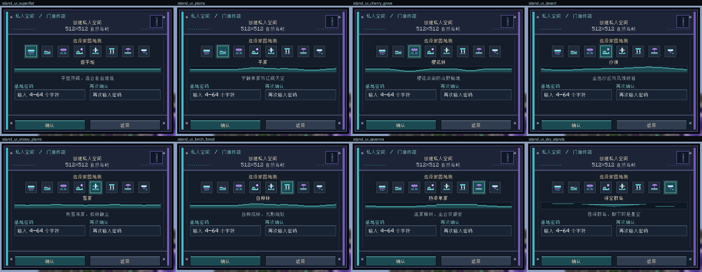
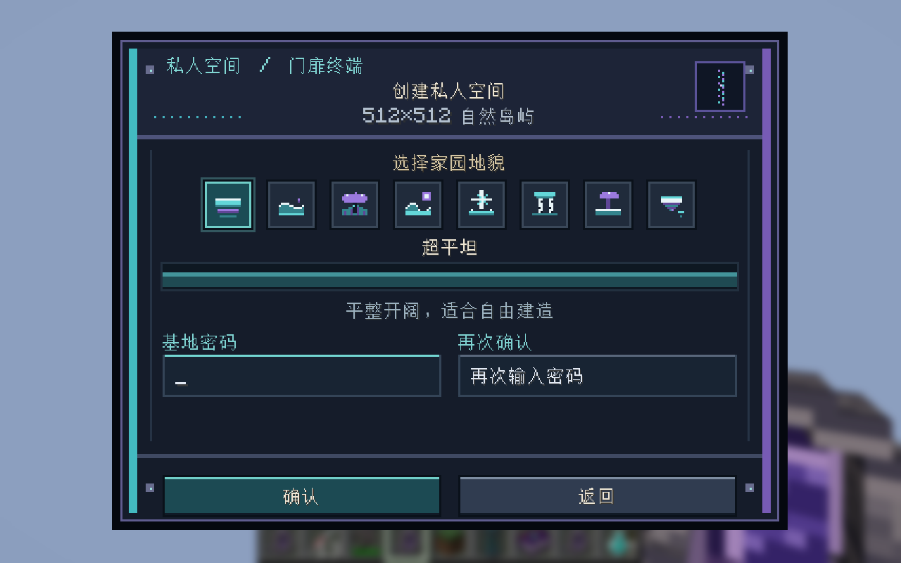
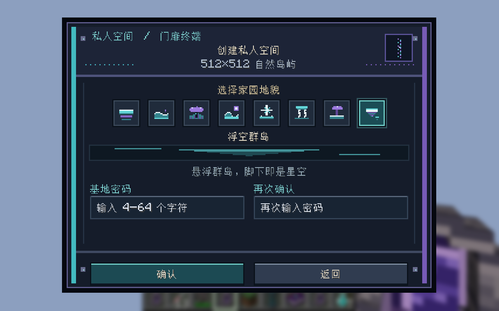
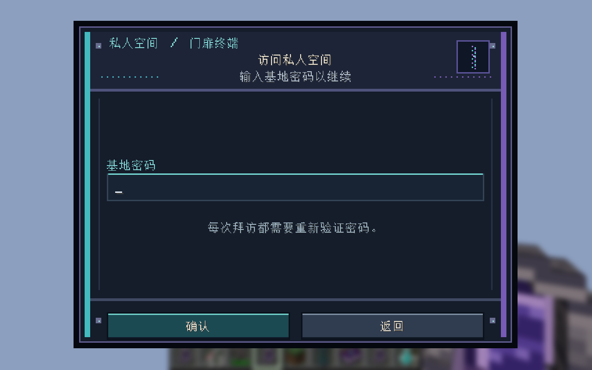
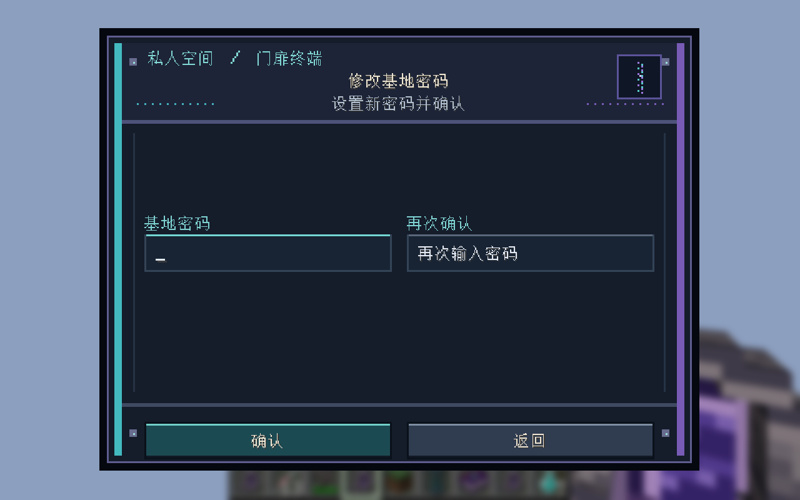
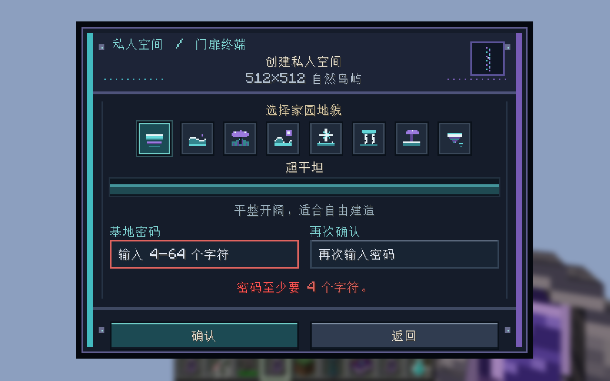
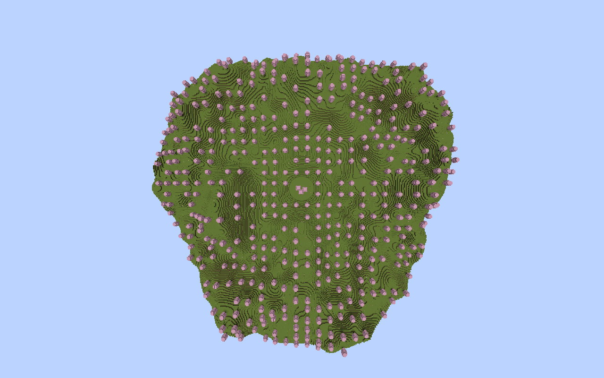
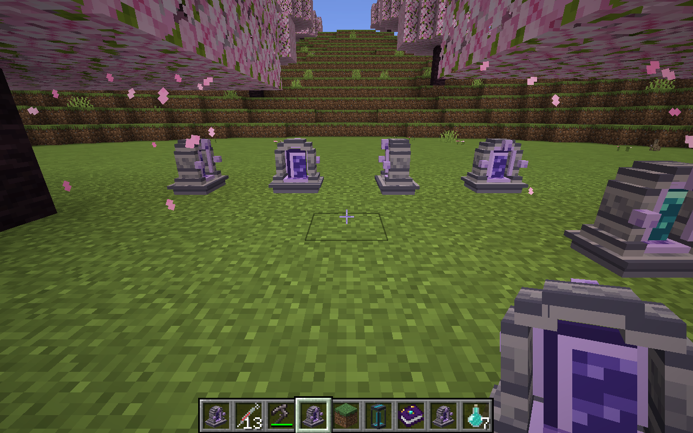
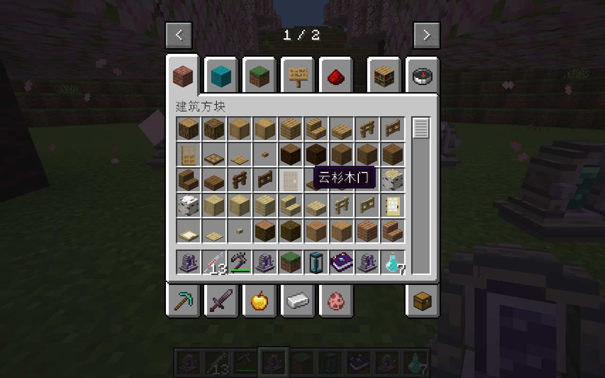

# 私人空间有限岛屿验收 — 2026-10-09

## 已验证的行为

- 独立 NeoForge GameTest 服务器：11/11 必需测试通过；实际加载的模组只有 Minecraft、NeoForge 和 Universal Tool。
- **8 种家园地貌**（超平坦、平原、樱花林、沙漠、雪原、白桦林、热带草原、浮空群岛）全部生成有限岛屿并逐项断言通过；范围外的八组区块全部为空，六组边缘区块的植被没有越过岛屿轮廓。
- 浮空群岛为「中央主岛 + 8 座环绕浮岛」的软并集地形：中央岛半径 76.8 保证出生点与返回门有实心落脚点；8 座卫星岛圆心距 141–187、半径 16–28，最远触及 197.3 < 256 的岛屿足迹，因此外围保持虚空空隙。
- 创建包经过入口距离、方块实体归属和密码校验后生成基地并传送；岛外飞行没有水平坐标限制，虚空救援保留背包并清除坠落状态，返回门恢复进入前的维度。
- 出生点独立于主世界，卸载并重新加载后仍保持一致；岛外放置的钻石块和岛内箱子中的物品均恢复。
- 生成器 Codec 和基地 SavedData 往返保存通过；修改密码保留生成版本、尺寸和种子。缺少版本的旧记录仍恢复为三种原生成器。
- **旧存档兼容性由字节码执行证明，而非算式推演**：同一次 JVM、两个隔离 ClassLoader 分别加载「重构前的 `build/libs/universal_tool-1.0.0.jar` 真实字节码」与「当前源码编译产物」，对 `surfaceY`/`bottomY`/`containsTerrain` 在 8 个采样点上输出**逐字符相同**（超平坦 seed=932174、平原 seed=932175、樱花林 seed=932176）。生成器版本常量仍为 `finite_island_v1`。
- 完整退出客户端并重启（`-PislandRestartOnly=true`）：有限种子、出生点、岛外建筑恢复通过。动态维度同步采用客户端确认后传送，类型编号在会话内保持稳定。
- 使用原有基地的独立存档副本，核对原生成器以及抽样区块的全部方块 checksum，卸载重载后保持一致。原始存档未被测试修改；这是抽样核对，不是所有已有区块的逐块审计。
- 两种 Blockbench 源模型的全部几何检查通过：17 个长方体、88 个可见面、64×64 图集、每模型单位 1 像素，比例和 UV 引用检查通过。

## 界面验收

创建界面重构为 320×236 面板，不超出 Minecraft 逻辑分辨率下限（320×240），因此在任意 GUI 缩放下都不会被裁切（旧版 344×248 在 854×480、缩放 2 时上下各裁 4 像素）。旧版「副标题与分隔线重叠」的布局缺陷已消除。

- **地貌选择器**为一行 8 个 16×16 像素徽记芯片，一键直达（替换原先「点击循环」的按钮），选中项有青色描边高亮；名称、描述、程序化侧视剪影随选择实时变化。
- **三种模式**均已重绘：创建（地貌选择 + 密码 + 确认）、拜访（单密码框 + 提示）、修改密码（新旧密码并排）。
- **校验失败不关闭界面**：空密码提交被拒绝后界面保持打开，密码框转为红色描边并在状态行内联显示「密码至少要 4 个字符。」。该行为由视觉测试断言 `client.screen` 未被替换。

下列截图由 `./gradlew runIslandVisual` 在真实客户端渲染输出（`build/island-visual/screenshots/`）：








## 实机截图





远景检查覆盖岛内 641 个地表抽样列，服务端和客户端都没有缺失。自动测试将镜头从地面直接移到高空时曾出现旧网格缓存缺口；重建客户端网格后，正常遮挡裁剪和关闭遮挡裁剪的截图都显示完整地形。截图没有通过图像修补填充地形。

## 耗时与适用范围

- 实际服务端创建请求样本：超平坦基地创建约 0.27–0.36 秒，记录包含初始安全区准备，不包含整个 512×512 的预生成。区块按需生成。
- 八环境代表性区块生成及断言样本约 0.46–5.9 秒（浮空群岛与白桦林最快，超平坦/平原/樱花林因区块量最大最慢）；同一套测试在机器有负载时复跑为 4–15 秒。这是本机测试样本，不是通用性能保证。
- 本次未做 1/5/10 真人在线的持续 MSPT、内存压测。测试服务器在同步强制生成多个区块时出现了短暂长 tick。
- 512×512 只应用于新建基地的自然地形；旧基地保留原地形，玩家搭建到岛屿外的方块也不会被裁剪。

## 复现

```powershell
.\gradlew.bat runIslandGameTest
python tools/generate_personal_space_textures.py
python tools/verify_personal_space_assets.py
python tools/prepare_island_visual_save.py "你的存档目录"
.\gradlew.bat runIslandVisual
.\gradlew.bat runIslandVisual -PislandRestartOnly=true
.\gradlew.bat build
```

GameTest 使用 `build/island-gametest`；视觉测试只操作 `build/island-visual/saves/island-visual` 的副本，截图写入 `build/island-visual/screenshots/`。测试功能均由专用运行配置的系统属性启用。
